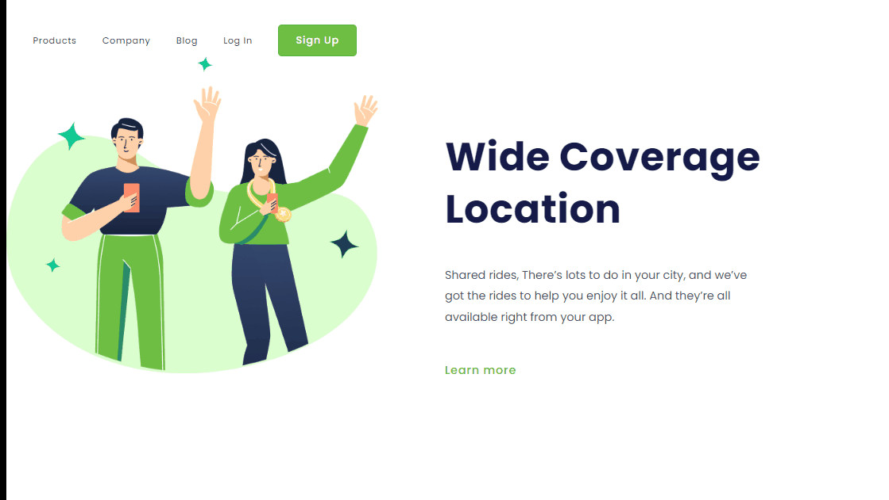

### Primeiro Projeto desenvolvido no Curso  DevClub🚀

### Desafio proposto criar um projeto com HTML, CSS para aprimorar os conhecimentos adquiridos durante as aulas.

### Como centralizar elementos
### Como estilizar textos
### Deixar  responsivo

[]

### Tecnologias Utilizadas

 
  
  

  